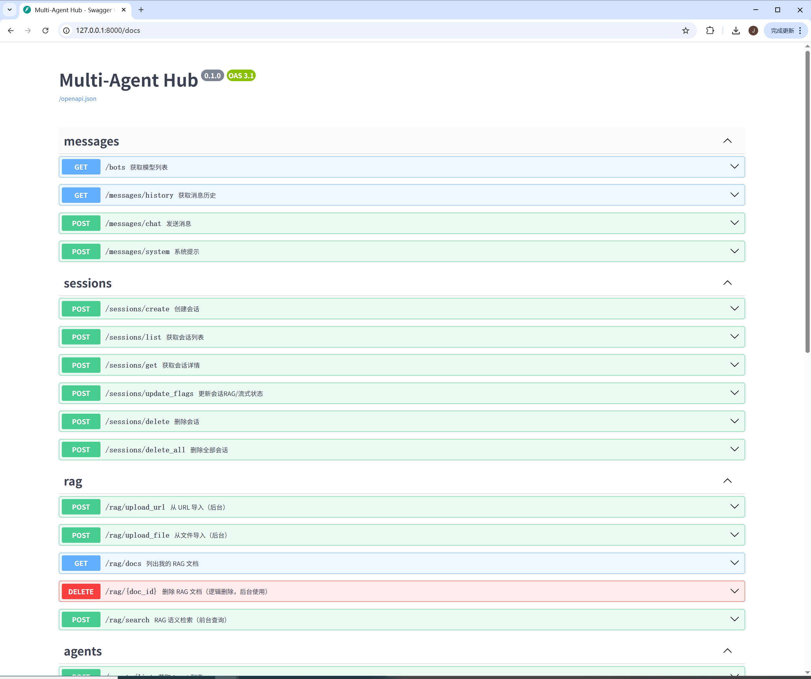
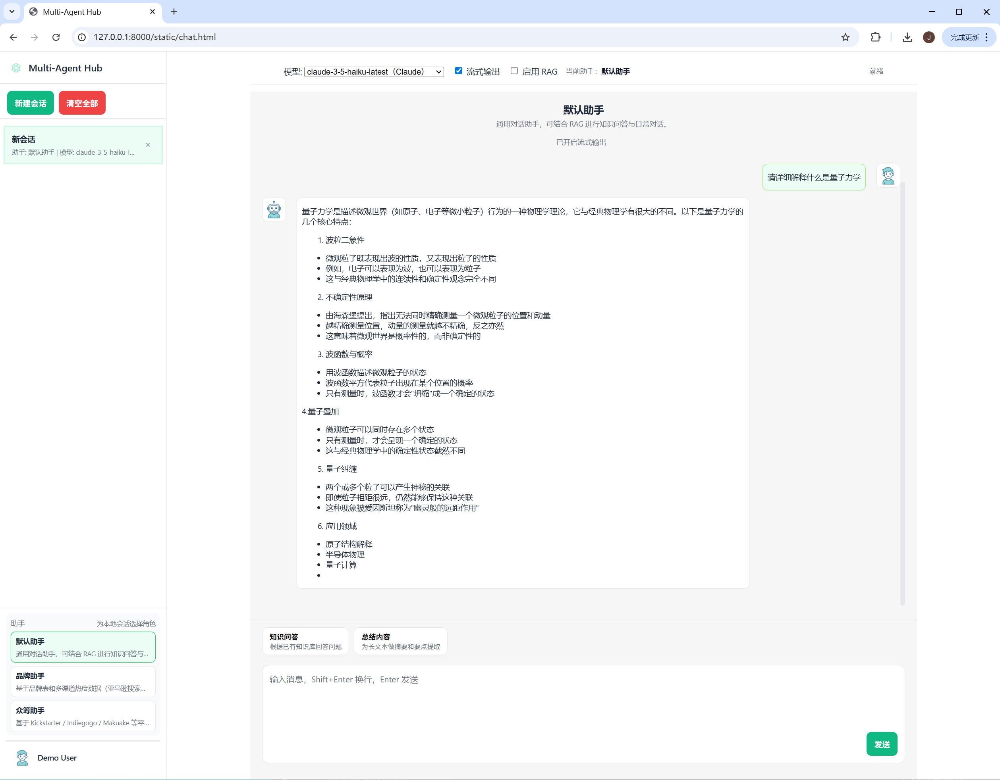
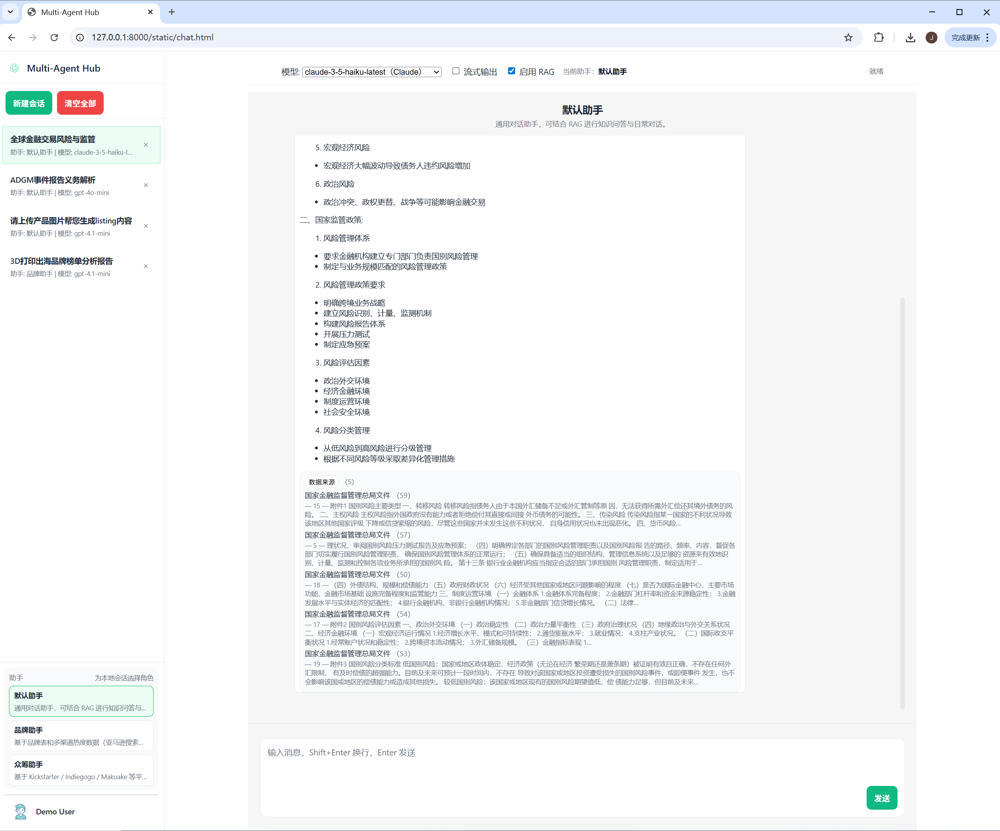
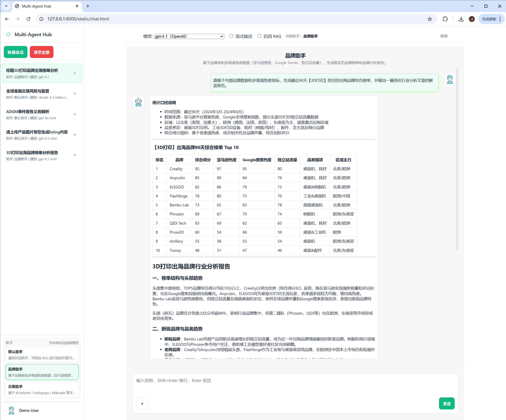

# Multi‑Agent Hub

> 多模型接入、多模态对话、RAG 检索、Agent 能力编排的一体化工程模板。面向企业级 AI 应用快速落地与可扩展实践。

---

## 1. 项目亮点

- **统一多模型抽象层**：以 `BotRegistry` + `BaseBot` 解耦 OpenAI / Claude / Gemini / Qwen / DeepSeek 等模型，天然支持**模型路由、降级与灰度**，可在运行时切换与扩展。
- **文本与图像双模态**：前端支持**图片上传**与**图片生成**，后端对 OpenAI 等模型做了**多模态适配**（文本 + 图片 URL 输入，文本 + 图片输出），对不支持图片的模型自动降级为文本。
- **RAG 增强与可插拔检索**：提供**分段策略**（可配置）、**Embedding 适配器**、**向量库抽象**（FAISS / Milvus / ES 可替换），并支持**召回 + （可选）重排**、**查询改写**与**提示构造模板**。
- **对话增强三件套**：
  - **语义缓存（Semantic Cache）**：相似问句命中缓存直接返回，**显著降低延迟与成本**；
  - **答案自检（Self‑Checker）**：对模型回复进行**事实性与引用匹配**的轻量自检，减少离谱回答；
  - **滚动摘要（Rolling Summary）**：按阈值自动生成会话摘要并注入 `system`，**稳住上下文**。
- **RAG/流式全链路**：同一条 API 支持**流式**与**非流式**，RAG 命中源在流尾以元数据块返回；非流式路径经 `AgentRuntime` 汇总上下文后一次性生成。
- **前端体验**：支持 **Markdown 渲染 + 代码高亮 + 图片预览**，输入框**自适应高度**，**图片上传键与发送键**固定在输入框内部底部栏。
- **可观测性与治理**：统一结构化日志，关键链路打点（RAG 命中率、缓存命中率、首字时延、总时延、Token 计量），方便接入 Prometheus/Grafana。
- **工程与架构粒度清晰**：领域模型 `Message / Attachment / RagSource` 明确；服务层 `MessageService / RagService / IntentService` 协同，**易读、易测、易扩展**。

---

## 2. 当前能力矩阵

| 能力 | 描述 | 实现位置/说明 |
|---|---|---|
| 多模型接入 | OpenAI、Claude、Gemini 等统一封装，按 `bots` 能力声明 `allow_image` | `bots/*_bot.py`, `bots/bot_registry.py` |
| 文本对话 | 支持流式/非流式；上下文拼接与截断 | `message_service.py`, `agent_runtime.py` |
| 图像对话 | 图片上传（本地/S3 可切换）+ 后端模型适配 | `files/*`, `openai_bot.py`（vision/生成） |
| 图片生成 | 文生图（已接入 OpenAI Images SDK 新接口） | `openai_bot.py::generate_image()` |
| RAG 检索 | 切分、Embedding、向量检索、召回结果注入 Prompt | `rag_service.py`, `rag/*`, `storage/vector_store_*` |
| 语义缓存 | 近似匹配直接返回历史优秀答案 | `core/semantic_cache.py`（存取），`message_service.py`（命中） |
| 答案自检 | 事实自检/引用覆盖率打分（轻量） | `core/answer_guard.py` |
| 滚动摘要 | 会话自动摘要并注入 system | `message_service.py::_maybe_generate_summary()` |
| 意图识别 | 基于轻量规则与 Embedding 的意图触发（如 RAG 开关） | `core/intent_service.py` |
| 前端能力 | Markdown + 高亮 + 图片预览 + 流式渲染 | `web/static/index.html` |
| 会话管理 | 新建/删除/重命名/标记 RAG & Stream | `infrastructure/data_storage_manager.py` + REST |

---

## 3. 目录结构（关键子系统）

```
multi-agent-hub/
├─ bots/                      # 多模型适配层（OpenAI/Claude/Gemini/...）
│  ├─ base_bot.py
│  ├─ openai_bot.py
│  └─ bot_registry.py
├─ core/                      # 纵向通用能力
│  ├─ agent_runtime.py        # 上下文构建 & 非流式执行入口
│  ├─ rag_service.py          # RAG 入口（或位于 core/rag_service）
│  ├─ intent_service.py       # 轻量意图识别
│  ├─ answer_guard.py         # 自检器
│  └─ semantic_cache.py       # 语义缓存
├─ domain/
│  ├─ enums.py                # Role, Channel, etc.
│  └─ message.py              # Message, Attachment, RagSource
├─ infrastructure/
│  ├─ config_manager.py
│  ├─ data_storage_manager.py # 持久化（会话 & 消息）
│  ├─ vector_store_manager.py # 向量库选择器
│  └─ mlogger.py              # 结构化日志
├─ rag/                       # RAG 细粒度组件
│  ├─ embeddings.py
│  ├─ loader.py               # URL/文件加载
│  ├─ splitter.py             # 文本切分策略
│  └─ reranker.py             # （可选）重排器占位
├─ storage/
│  ├─ vector_store_base.py
│  ├─ vector_store_faiss.py
│  └─ file_storage/           # Local/S3 抽象
└─ web/static/index.html      # 前端单页（Markdown、流式、图片上传）
```

---

## 4. 核心架构与链路

### 4.1 消息到回复（非流式）

```
Client -> /messages/chat (stream=false)
  -> MessageService
     - 存历史 -> 构上下文(system + 摘要 + 历史)
     - 语义缓存命中？是 -> 直接返回
     - 意图识别：是否触发 RAG/工具
     - RAG：检索/改写/重排/注入 prompt
     -> AgentRuntime.run(...)
        -> Bot.chat(messages)
     <- 生成结果 + RAG 源
  <- 返回 JSON（reply, sources, attachments?）
```

### 4.2 消息到回复（流式）

```
Client -> /messages/chat (stream=true)
  -> MessageService
     - 同上（但不经 AgentRuntime）
     -> Bot.chat(..., stream=True)
     <- SSE/Chunked 文本片段
     - 结束时附带 [[RAG_SOURCES]] 元数据块
  <- 浏览器增量渲染（Markdown）
```

### 4.3 RAG 检索链

```
User Query
  -> Intent 判定（是否需要 RAG / 哪类文档域）
  -> Query Rewrite（可选：模板 + 关键词扩展）
  -> Vector Search（FAISS/Milvus）
  -> （可选）Cross-Encoder 重排
  -> Prompt Injection（系统提示 + TopK Snippets）
  -> LLM 生成 +（自检器/引用覆盖率）
```

---

## 5. 接口契约（后端）

### 5.1 ChatRequest

```python
class ChatRequest(BaseModel):
    user_id: int
    session_id: str
    role: Role = Role.USER
    content: str
    attachments: List[AttachmentDTO] = []
    stream: bool = False
    rag_enabled: bool = False
    channel: Channel = Channel.WEB
```

### 5.2 AttachmentDTO

```python
class AttachmentDTO(BaseModel):
    id: str
    type: AttachmentType
    url: str      # 已上传后的可访问地址（或 CDN）
    mime_type: Optional[str] = None
    file_name: Optional[str] = None
    size_bytes: Optional[int] = None
    meta: Dict[str, Any] = {}
```

> 说明：图片上传与模型生成的图片均保存到统一 `FileStorage`（本地/S3 可切换），前端只接收**可访问 URL**。

---

## 6. 部分技术实现

### 6.1 语义缓存（命中即回）
- 基于向量近似搜索存储**高质量问答对**（使用回答后评分或显式标注），计算 `cosine`/`dot` 相似度。
- 在 `MessageService` 入口对用户 query 向量化，若命中阈值（可配），直接返回缓存答案并打点。

### 6.2 答案自检（轻量 Guard）
- 检测回复中的**事实声明**与 RAG 片段匹配度；
- 对超出引用的断言给出“低置信提示”或建议查看来源；
- 标记敏感内容（越权、个人信息、涉黄暴等）为“需人工审核”。

### 6.3 滚动摘要
- 每 N 轮对话自动触发摘要（阈值/最大片段可配）；
- 以 `[[SUMMARY]]...` 系统消息落盘，不参与历史拼接，但在下一轮以 `system` 注入；
- 控制上下文窗口占用，稳定回复风格与事实。

### 6.4 RAG 可优化位
- 切分：按**语义句** + **最大 token** + **重叠**，避免割裂；
- 检索：支持**混合检索**（BM25 + 向量）；
- 重排：接入 Cross‑Encoder（如 bge‑rerank）提高 TopK 质量；
- 归并：多段来源**去重与合并摘要**，降低 prompt 噪音；
- 领域：多索引/多域路由（产品、政策、FAQ），减小搜索空间。

### 6.5 多模态适配
- `allow_image` 能力声明，前端自动显示/隐藏图片入口；
- OpenAI 图片生成使用**新 SDK**（`client.images.generate(...)`），并落地到统一存储；
- 视觉对话路径对不支持图片的模型自动降级文本描述。

---

## 7. 配置与部署

- 配置项（节选）：
  - `openai_api_key` / `openai_base_url` / `openai_max_token`
  - `embedding.{provider, dim}`
  - `rag.{top_k, split.target_tokens, split.max_tokens, split.sentence_overlap}`
  - `semantic_cache.{enabled, threshold, max_entries}`
  - `summary.{enabled, every_n_turns, max_pairs}`
- 存储：本地文件或 S3 通过 `FileStorage` 统一抽象；向量库通过 `vector_store_manager` 切换 FAISS / Milvus。

> 生产建议：开启鉴权、限流、审计；收敛敏感接口（上传/删除）。

---

## 8. 效果展示
- 项目主页面 


- 部分接口


- 流式对话


- RAG与消息来源


- Agent


---

## 9. 面向业务的可用方案（结合本项目快速落地）

- **内部知识问答**：导入产品/政策/流程文档，RAG 检索 + 自检 + 引用展示，提升准确率与可追溯性。
- **客户支持助手**：多模型后备与降级，异常时切至本地模型或轻量回答模板保障 SLA。
- **图片解析/方案审阅**：截图/海报/界面 UI 解析为结构化要点，辅助评审与素材整理。
- **对话式报表/洞察**：为各角色提供“问一答一”的洞察通道（数据层可替换为内部 API + 工具调用）。

---

## 10. 路线规划（下一版）

- **工具调用（Function/Tool Calling）内核化**：
  - 工具注册中心 + 权限域；
  - 计划/预算/系统状态等**受控数据 API**；
  - 失败重试、幂等与回滚策略；
  - 多步推理的**轨迹落盘**与可视化。

- **RAG 质量体系**：
  - **Hybrid 检索**与**Cross‑Encoder 重排**默认化；
  - 结果**去重归并**与**引用覆盖率评分**；
  - **离线评测集**与**覆盖率/准确率**仪表盘。

- **模型路由与成本感知**：
  - 基于请求类型/长度/时延目标进行**动态选型**；
  - **缓存/截断/摘要**策略前置以控窗与控费。

- **监控与审计**：
  - Prometheus 指标：P50/P95、首字延迟、RAG 命中率、Cache 命中率、Token 用量；
  - 追踪 ID 贯穿前后端，复盘单次会话链路。

- **安全与合规**：
  - 输入/输出内容审核；
  - PII 脱敏、存储加密；
  - 审计报表与留痕。

---

## 11. 开发指引

- **快速启动**：
  1. 配置 `infrastructure/config_manager` 所需密钥与存储；
  2. 启动后端（FastAPI 服务）与前端静态页；
  3. 浏览器选择模型、是否开启 RAG、是否流式，上传图片并对话；
  4. 在会话列表中查看标题自动生成与历史记录。

- **二次开发建议**：
  - 新增模型：实现 `BaseBot` 接口并在 `BotRegistry` 注册；
  - 换向量库：实现 `VectorStoreBase` 并在 `vector_store_manager` 切换；
  - 定制 RAG：在 `rag/*` 扩展切分、检索与重排策略；
  - 接入工具：在下一版 `tool_registry` 中注册并配置调用白名单。

---

## 12. 维护脚手架与定位

- 结构化日志：统一 `mlogger`（模块、事件、耗时、TraceId）；
- 配置中心：本地配置亦可替换为远程配置；
- 单元测试：建议对 `rag`, `intent`, `semantic_cache` 与 `bots` 做隔离测试。

---

## 13. 许可

本项目仅用于学习与内部 PoC 演示，禁止用于违法合规场景。第三方模型与 API 的使用需遵照其相应许可。

---

> 如需将本模板用于特定业务，请在 `core/intent_service.py` 中完善意图识别与路由规则，并在 `core/rag_service.py` 调整领域索引管理与检索策略。